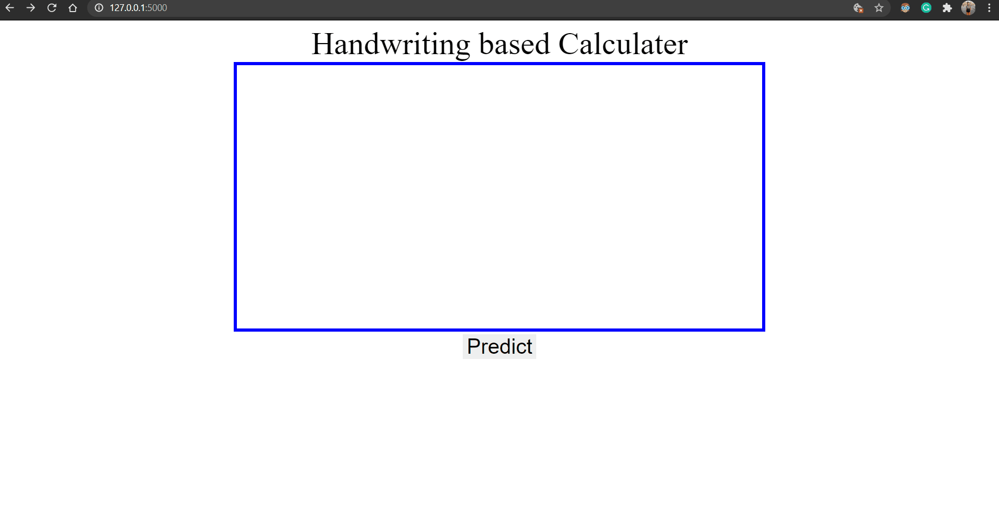

# HandwittingBasedCalculator

A Calculator Web App that recognizes handwritten numbers and math symbols and can perform airthmetic and relational operations.

Based on a CNN model that classifies the symbol into 0:9, +, -, x, >, < and neq after extracting it from the input image using image processing techniques.

### Libraries Used:
* [Keras](https://keras.io/) : for building and training a CNN model
* [OpenCV](https://opencv.org/) : for image processing tasks
* [Flask](https://flask.palletsprojects.com/) : for deploying as a web app

### App in Action:

 - can recognize multi-digit numbers and perform airthmetic operations:

- can perform relational operations and gives result as True or False: 

- can check if the syntax is correct or not: 

### WorkFlow:
- Data acquisition: [Dataset from Kaggle](https://www.kaggle.com/xainano/handwrittenmathsymbols/)
- Data cleaning and processing: cleaned data for required symbols to data_cleaned.rar (extracted) 
- Data Modelling: Built and Trained CNN model using Keras
- Input image pre-processed using OpenCV for basic image processing and to extracted contours to get individual symbols
- Each symbol predicted by giving extracted symbol image as an input to the model
- Mathematical operations are performed on the predictions and ouput a final result
- Data deployment: Used Flask to deploy the model as a web app to provide the user a simple interface

### Todos:
 - Add more symbols like divide, log, square root, etc.
 - Improve web app, make more dynamic and responsive
 - Add functionalities to the drawing canvas like resize, eraser, etc.
